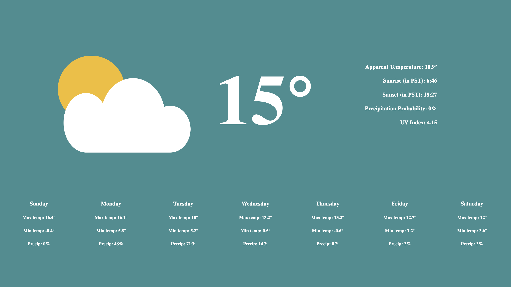

# Weather App

An accurate Weather App that pulls data from OpenMateo's weather API (can be found here: (https://open-meteo.com)). Weather information is for Vancouver, BC and times are in PST.

Information displayed in weather app includes: 
- Current temperature (in °C)
- Apparent temperature (in °C)
- Sunrise (in PST)
- Sunset (in PST)
- Probability of precipitation with more than 0.1 mm of the preceding hour (in %)
- UV Index

- Daily maximum temperatures for the week (in °C)
- Daily minimum temperatures for the week (in °C)
- Daily probability of precipitation with more than 0.1 mm for the week (in %)

## Screenshots

## Technologies Used

- HTML
- CSS
- JavaScript 

## Author

- Sydney Quach